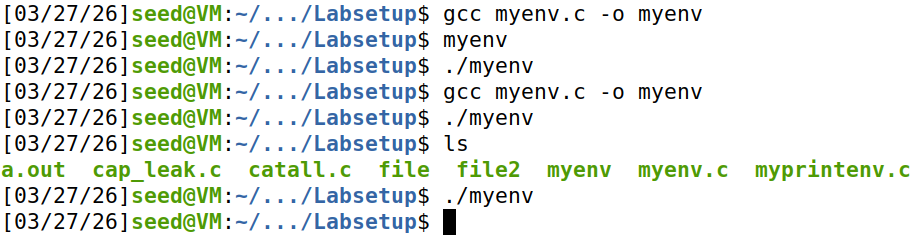
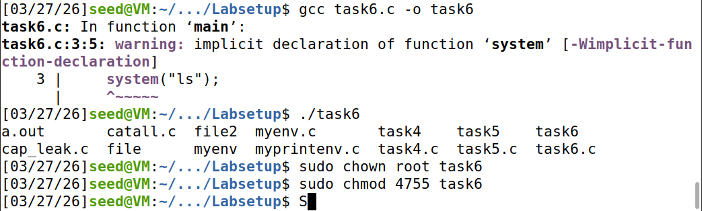
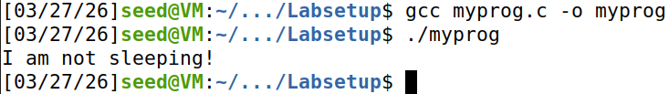
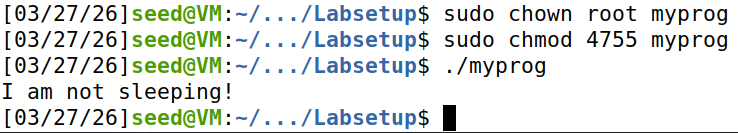
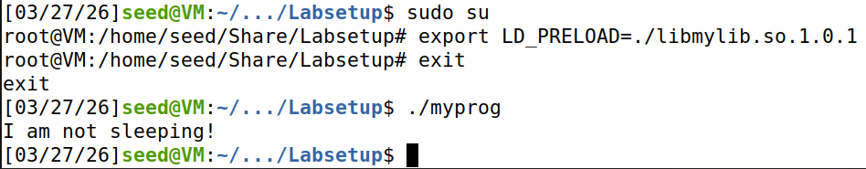
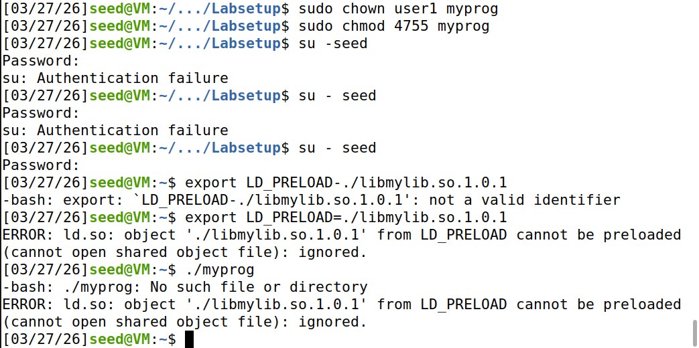

# **Seed Security Lab**

### Task 1: Manipulating Environment Variables
#### Step 1. Use *printenv* or *env* to print out environment vairables
If you are interested in some particular environment variables, such as PWD, you can use "printenv PWD" or "env | grep PWD"

#### Step 2. Use *export* and *unset* to set or unset environment variables

---
### Task 2: Passing Environment Variables from Parent Process to Child Process
#### Step 1. Compile and run the following program, and describe your observation:
The child process prints a full list of environment variables. This is because by using the fork() system call, the child process created inherits an exact copy of the parent process, including the environment.

    #include <unistd.h>
    #include <stdio.h>
    #include <stdlib.h>
    extern char **environ;
    void printenv()
    {
        int i = 0;
        while (environ[i] != NULL) {
            printf("%s\n", environ[i]);
            i++;
        }
    }
    void main()
    {
        pid_t childPid;
        switch(childPid = fork()) {
            case 0: /* child process */
                printenv(); ➀
                exit(0);
            default: /* parent process */
                //printenv(); ➁
            exit(0);
        }
    }

#### Step 2. Comment out the *printenv()* statement in the child process case (Line ➀), and uncomment the *printenv()* statement in the parent process case (Line ➁). Describe your observations
The output looks the same as the first file printed.

#### Step 3. Compare the difference of the two files using the *diff* command. Please draw your conclusion
The diff output shows only a minor difference in variables (29c29 | 38c38 | 47a48 | 49d49) Overall, the environment variables are the same, confirming that the child process inherits them from the parent during fork().

---
### Task 3: Environment Variables and *execve()*
#### Step 1. Compile and run the following program, and describe your observation. 
This program executes a program called /usr/bin/env, which prints out the environment variables of the current process.

Nothing is printing

Listing 2: myenv.c

    #include <unistd.h>
    extern char **environ;
    int main()
    {
        char *argv[2];

        argv[0] = "/usr/bin/env";
        argv[1] = NULL;
        execve("/usr/bin/env", argv, NULL); ➀

        return 0 ;
    }

#### Step 2. Change the invocation of *execve()* in Line ➀ to the following; describe your observation

    execve("/usr/bin/env", argv, environ);

The environment variables print. This means that environment variables are NOT automatically passed in execve(), requiring the environ parameteter to explicitly provide them.

#### Step 3. Please draw your conclusion regarding how the new program gets its environment variables
The new program gets its environment variables from the third argument of execve(). Unlike fork(), which automatically copies the parent’s environment, execve() does not inherit it unless it is explicitly passed, meaning that the environment must be manually provided using the environ variable.

---
### Task 4: Environment Variables and *system()*
#### Step 1. using system(), the environment variables of the calling process is passed to the new program /bin/sh. Compile and run the following program to verify this.

    #include <stdio.h>
    #include <stdlib.h>
    int main()
    {
        system("/usr/bin/env");
        return 0 ;
    }

Task successfully verified, environment variables are printed
---
### Task 5: Environment Variable and Set-UID Programs
#### Step 1. Write the following program that can print out all the environment variables in the current process.

    #include <stdio.h>
    #include <stdlib.h>
    extern char **environ;
    int main()
    {
        int i = 0;
        while (environ[i] != NULL) {
            printf("%s\n", environ[i]);
            i++;
        }
    }

All environment variables in the current process are printed out, as expected
#### Step 2. Compile the above program, change its ownership to root, and make it a Set-UID program.

    // Asssume the program’s name is foo
    $ sudo chown root foo
    $ sudo chmod 4755 foo

my file is named *task5*

#### Step 3. In your shell, use the export command to set the following environment variables (they may have already exist):
(you need to be in a normal user account, not the root account)

• PATH

• LD_LIBRARY_PATH

• MYVAR=hello_world

    run: ./task 5

All of the environment variables inside the Set-UID process are printed, but the presence of LD_LIBRARY_PATH in the Set-UID program is unexpected because such variables are often considered dangerous in privileged programs. While Set-UID programs inherit and display environment variables, sensitive variables like LD_LIBRARY_PATH are ignored by the system at execution time, preventing attackers from influencing privileged behavior.

---
### Task 6: The PATH Environment Variable and Set-UID Programs
You can change the PATH environment variable in the following way (this example adds the directory /home/seed to the beginning of the PATH environment variable):$ export PATH=/home/seed:$PATH

The Set-UID program below is supposed to execute the /bin/ls command; however, the programmer only uses the relative path for the ls command, rather than the absolute path:

    int main()
    {
        system("ls");
        return 0;
    }

Please compile the above program, change its owner to root, and make it a Set-UID program. 

Can you get this Set-UID program to run your own malicious code, instead of /bin/ls? 

I was able to get the Set-UID program to run my own malicious code instead of /bin/ls. I created a fake ls file in my current directory and changed the PATH variable to include . at the beginning. When the program ran, it used system("ls"), and the shell found my fake ls first, so it executed my code instead of the real /bin/ls.

If you can, is your malicious code running with the root privilege? Describe and explain your observations.

At first, the malicious code did not run with root privileges—the id output showed my normal user ID. This is because Ubuntu uses /bin/dash for /bin/sh, and it automatically drops privileges in Set-UID programs. After switching /bin/sh to /bin/zsh, the malicious code ran as root (uid=0). This shows that the attack works, but gaining root access depends on whether the shell drops privileges.

---
### Task 7: The *LD_PRELOAD* Environment Variable and Set-UID Programs
#### Step 1. First, we will see how these environment variables influence the behavior of dynamic loader/linker when running a normal program. Please follow these steps:
Let us build a dynamic link library. Create the following program, and name it mylib.c. It basically overrides the sleep() function in libc:

    #include <stdio.h>
    void sleep (int s)
    {
        /* If this is invoked by a privileged program, you can do damages here! */
        printf("I am not sleeping!\n");
    }

We can compile the above program using the following commands (in the -lc argument, the second character is `):

    $ gcc -fPIC -g -c mylib.c
    $ gcc -shared -o libmylib.so.1.0.1 mylib.o -lc

Now, set the LD PRELOAD environment variable

    $ export LD_PRELOAD=./libmylib.so.1.0.1

Finally, compile the following program myprog, and in the same directory as the above dynamic link library libmylib.so.1.0.1:

    /* myprog.c */
    #include <unistd.h>
    int main()
    {
        sleep(1);
        return 0;
    }

#### Step 2. After you have done the above, please run myprog under the following conditions, and observe what happens.
Make myprog a regular program, and run it as a normal user.

LD_PRELOAD **works** because the program runs with normal privileges.

Make myprog a Set-UID root program, and run it as a normal user.

LD_PRELOAD is supposed to be *blocked* to prevent privilege escalation.

Make myprog a Set-UID root program, export the LD PRELOAD environment variable again in
the root account and run it.

LD_PRELOAD *works* because root running its own program is safe.

Make myprog a Set-UID user1 program (i.e., the owner is user1, which is another user account), export the LD PRELOAD environment variable again in a different user’s account (not-root user) and run it.

LD_PRELOAD is supposed to be *blocked* to stop non-owner users from injecting code.

#### Step 3. Please design an experiment to figure out the main causes, and explain why the behaviors in Step 2 are different. 
 (Hint: the child process may not inherit the LD * environment variables).

For normal programs, LD_PRELOAD is honored, allowing the custom library to override functions like sleep(). However, for Set-UID programs, the system ignores LD_PRELOAD to prevent security risks.

This happens because environment variables starting with LD_ are considered unsafe in privileged contexts. As a result, they are removed or ignored when executing Set-UID programs. This prevents attackers from injecting malicious shared libraries into privileged processes.

----
### Task 8: Invoking External Programs Using *system()* versus *execve()*
Listing 3: catall.c

    int main(int argc, char *argv[])
    {
        char *v[3];
        char *command;

        if(argc < 2) {
            printf("Please type a file name.\n");
            return 1;
        }

        v[0] = "/bin/cat"; v[1] = argv[1]; v[2] = NULL;
        command = malloc(strlen(v[0]) + strlen(v[1]) + 2);
        sprintf(command, "%s %s", v[0], v[1]);
        
        // Use only one of the followings.
        system(command);
        // execve(v[0], v, NULL);
        return 0 ;
    }

#### Step 1. Compile the above program, make it a root-owned Set-UID program. The program will use system() to invoke the command. If you were Bob, can you compromise the integrity of the system? For example, can you remove a file that is not writable to you?

If I were Bob, system can be compromised when system() is used in a Set-UID program. This is because system() invokes a shell, which uses environment variables such as PATH. By modifying PATH, an attacker can execute malicious programs with root privileges, potentially deleting or modifying protected files.

#### Step 2. Comment out the system(command) statement, and uncomment the execve() statement; the program will use execve() to invoke the command. Compile the program, and make it a root-owned Set-UID. Do your attacks in Step 1 still work? Please describe and explain your observations

When execve() is used, the attack no longer works because execve() directly executes the specified program without invoking a shell. It does not rely on the PATH environment variable, making it more secure and preventing the execution of malicious code through path manipulation.

---
### Task 9: Capacity Leaking
Compile the following program, change its owner to root, and make it a Set-UID program. Run the program as a normal user. Can you exploit the capability leaking vulnerability in this program? The goal is to write to the /etc/zzz file as a normal user.

Listing 4: cap leak.c

    void main()
    {
        int fd;
        char *v[2];

        /* Assume that /etc/zzz is an important system file,
        * and it is owned by root with permission 0644.
        * Before running this program, you should create
        * the file /etc/zzz first. */
        fd = open("/etc/zzz", O_RDWR | O_APPEND);
        if (fd == -1) {
        printf("Cannot open /etc/zzz\n");
        exit(0);
        }

        // Print out the file descriptor value
        printf("fd is %d\n", fd);
        // Permanently disable the privilege by making the
        // effective uid the same as the real uid
        setuid(getuid());

        // Execute /bin/sh
        v[0] = "/bin/sh"; v[1] = 0;
        execve(v[0], v, 0);
    }

initial run:

file created:

The exploit did not work because, although the program opens /etc/zzz with root privileges, it later drops its privileges using setuid(getuid()) before launching the shell.However, the opened file descriptor fd still retains root-level access.

It fails because the exploit did not make use of this inherited file descriptor inside the new shell. To successfully exploit the vulnerability, the attacker must directly write to /etc/zzz using the existing file descriptor (e.g., via /proc/self/fd/<fd>).

This demonstrates a capability leaking vulnerability, where privileged access is preserved through open file descriptors even after privileges are dropped.
(I also did some research and this happens sometimes with shared folders on VMs)